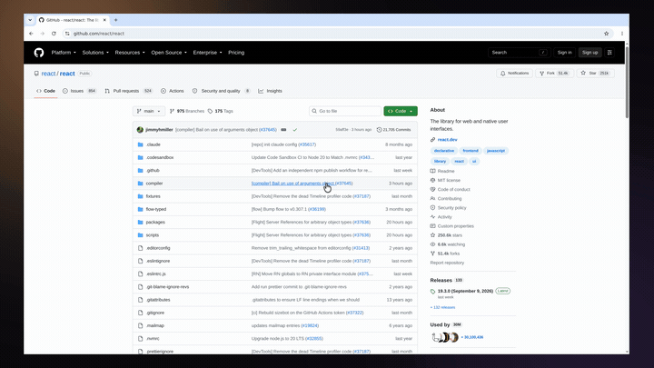
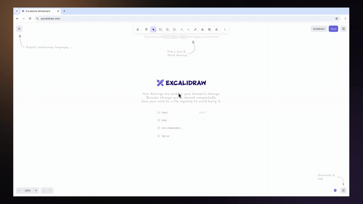
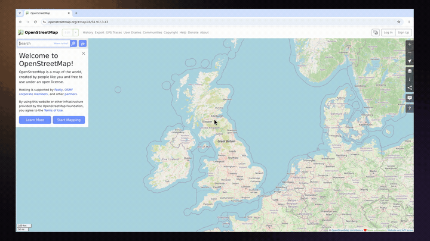
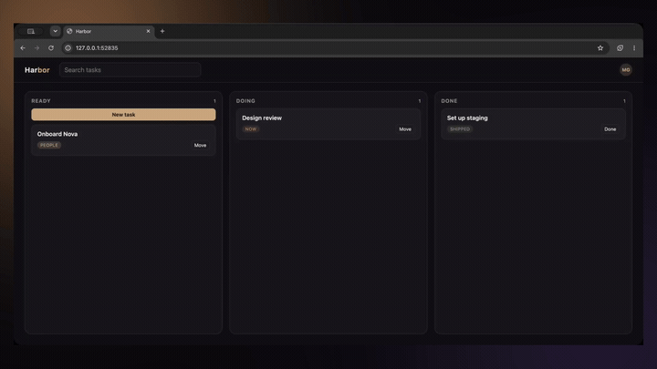

# record-bot

Headless CLI that lists capture targets and records a screen or window to MP4. No GUI. Stdout is for results; logs go to stderr. `--json` prints one JSON object.

By default the file at `-o` is a **styled** video: padding, background, cursor overlay, and auto-zoom that follows the pointer. The unstyled capture is kept beside it as `<name>.raw.mp4`. Pass `--no-style` if you only want the raw file.

macOS captures with ScreenCaptureKit helpers in `native/darwin`. Windows and Linux capture with FFmpeg (`gdigrab` / `x11grab`).

## Demos

Recordings from the demo runner, styled with padding, background, a 60 fps cursor overlay, and cursor-follow auto-zoom. Each one is a scripted Playwright walkthrough; the source is in [`demo/scenarios`](demo/scenarios). The GIFs are downscaled, so click any one for the full-quality MP4.

<table>
  <tr>
    <td align="center" width="50%">
      <a href="demos/github.mp4"></a>
      <br><sub><b>GitHub</b>: public repo tour across Code, Issues, and Pull requests (no login)</sub>
    </td>
    <td align="center" width="50%">
      <a href="demos/excalidraw.mp4"></a>
      <br><sub><b>Excalidraw</b>: sketch a rectangle and an ellipse, then connect them</sub>
    </td>
  </tr>
  <tr>
    <td align="center" width="50%">
      <a href="demos/openstreetmap.mp4"></a>
      <br><sub><b>OpenStreetMap</b>: search a landmark and pan the map to it</sub>
    </td>
    <td align="center" width="50%">
      <a href="demos/harbor.mp4"></a>
      <br><sub><b>Harbor</b>: local task board; search, add a task, and move cards</sub>
    </td>
  </tr>
</table>

To record one yourself, run `npm run demo -- --list`, then `npm run demo -- --scenario github`.

## Install

Node.js 22.18 or newer.

```bash
git clone https://github.com/hasangenc0/record-bot.git
cd record-bot
npm install
```

On macOS, `npm install` runs `make capture-if-needed` and compiles the helpers if they are missing. That needs Xcode Command Line Tools (`xcode-select --install`). Rebuild with `make capture`.

```bash
npm run cli -- --help
# or, after npm link:
record-bot --help
```

GitHub Releases ship a compiled binary plus `helpers/` (macOS capture tools and FFmpeg), `skills/` (the agent playbook), and `python/` (the voiceover helper). Keep those folders next to `record-bot`.

```bash
tar -xzf record-bot_*_Darwin_arm64.tar.gz
cd record-bot_*_Darwin_arm64
./record-bot sources --json
```

## Commands

```bash
record-bot skill --json
record-bot schema --json
record-bot sources --json
record-bot record --screen 1 -o demo.mp4 --duration 10 --json
record-bot record --window Safari --mic --system-audio --duration 30 -o demo.mp4
record-bot record --screen 1 -o demo.mp4 --duration 10 --background wall.jpg --padding 96 --crop 120,80,1280,720
record-bot record --screen 1 -o demo.mp4 --duration 10 --no-style
record-bot voiceover --text "Hello from record-bot." -o vo.wav --json
record-bot install-tts --json
record-bot mux --video demo.mp4 --audio vo.wav -o demo.narrated.mp4 --json
```

| Flag | Command | Meaning |
| --- | --- | --- |
| `--json` | sources, record, voiceover, install-tts, mux, skill, schema | One JSON object on stdout (`schema` always prints JSON) |
| `--screens` / `--windows` | sources | Filter targets |
| `--screen <n>` | record | 1-based screen from `sources` |
| `--display-id <id>` | record | Raw display id |
| `--window <name>` | record | Substring match on app or title |
| `--window-id <id>` | record | Raw window id |
| `-o, --output <path>` | record | Styled MP4 (or raw if `--no-style`) |
| `--raw-output <path>` | record | Raw capture path (default `<output>.raw.mp4`) |
| `-d, --duration <n>` | record | Stop after `30`, `10s`, or `1m` |
| `--mic` / `--system-audio` | record | Audio (written as sidecar files next to the raw MP4) |
| `--no-style` | record | Skip compose; `-o` is the raw capture |
| `--background <color\|path>` | record | Canvas color (`#1a1a24`) or image |
| `--padding <px>` | record | Margin around the capture (default 80) |
| `--zoom auto\|off\|<n>` | record | Cursor-follow zoom (default `auto`, max 1.7) |
| `--cursor` / `--no-cursor` | record | Draw a pointer on the styled video |
| `--size WxH` | record | Styled canvas (default `1920x1080`) |
| `--crop x,y,w,h` | record | Keep this rectangle of the raw capture (also `WxH+X+Y`) |
| `--text` / `--text-file` | voiceover | Words to speak |
| `--ref-audio` / `--ref-text` | voiceover | Voice sample and its transcript (defaults to a bundled English clip) |
| `--speed` / `--seed` / `--nfe-step` | voiceover | Rate, reproducibility, and denoising steps |
| `--video` / `--audio` | mux | Recorded MP4 and voiceover WAV |
| `-o, --output <path>` | mux | Muxed MP4 |
| `--delay <duration>` | mux | Silence before the audio (`0.5`, `500ms`, `1s`) |
| `-d, --duration <n>` | mux | Output length (default: delay plus audio) |

Ctrl+C stops an open-ended recording. The process waits until capture **and** compose finish.

## Voiceover

`voiceover` runs [F5-TTS](https://github.com/SWivid/F5-TTS) locally and writes a WAV. The first call installs Python 3.12, PyTorch, and `f5-tts` into the user data directory (macOS: `~/Library/Application Support/record-bot/tts`). That needs network and several GB of disk; later calls reuse it. The first synthesis also downloads model weights (~1.3GB). To bake this into a VM or image:

```bash
record-bot install-tts --json
```

That command installs the env and downloads the default model weights. `--skip-weights` installs the Python env only. Override with `RECORD_BOT_F5TTS_PYTHON` if you already have an interpreter. From a source checkout, `make f5-tts` still creates a repo-local `.venv`. Use a clean reference clip under 12 seconds; leave about a second of silence at the end.

```bash
record-bot voiceover --text "Welcome to the demo." -o /tmp/vo.wav --json
record-bot voiceover --text-file script.txt --ref-audio voice.wav --ref-text "Exact words in the sample." -o /tmp/vo.wav --json
```

## Mux

`mux` overlays a WAV (or other audio) onto a recorded MP4. Default output length is `--delay` plus the audio duration. If the video is shorter, the last frame is cloned.

```bash
record-bot mux --video /tmp/demo.mp4 --audio /tmp/vo.wav -o /tmp/demo.narrated.mp4 --json
record-bot mux --video /tmp/demo.mp4 --audio /tmp/vo.wav -o /tmp/out.mp4 --delay 500ms --json
```

## Demo

Playwright drives a scenario, records the Chromium window, and calls `mux` to overlay an optional F5-TTS voiceover onto the styled MP4. Scenarios live in `demo/scenarios/` and target either a local app (served over HTTP) or a live URL.

```bash
make f5-tts
npx playwright install chromium
npm run demo -- --list                 # list scenarios
npm run demo                           # harbor (local board app)
npm run demo -- --scenario github      # live GitHub repo tour (no login)
npm run demo -- --scenario excalidraw  # live whiteboard: sketch shapes on a canvas
npm run demo -- --scenario osm         # live OpenStreetMap: search + pan
npm run demo -- --scenario github --no-voiceover
```

Output: `demo/out/<scenario>.mp4`. Grant Screen Recording to the Node process. The first voiceover may install F5-TTS and download weights (~1.3GB). Add a demo by dropping a `Scenario` file in `demo/scenarios/` and registering it in `demo/scenarios/index.ts`.

## JSON

Agents should load the playbook, then the typed catalog:

```bash
record-bot skill --json
record-bot schema --json
```

`schema --json` lists every command, flag types/defaults, env vars, and success/failure shapes.

Success:

```json
{ "ok": true, "sources": [{ "id": "screen:1", "name": "Screen 1 (Primary)", "displayId": "1", "sourceType": "screen" }] }
```

```json
{
  "ok": true,
  "path": "/tmp/demo.mp4",
  "rawPath": "/tmp/demo.raw.mp4",
  "sidecars": ["/tmp/demo.raw.cursor.jsonl"],
  "durationMs": 11240,
  "source": { "id": "screen:1", "name": "Screen 1 (Primary)", "sourceType": "screen" },
  "style": { "padding": 80, "background": "#1a1a24", "zoom": "auto:1.7", "cursor": true, "size": "1920x1080", "crop": null }
}
```

Failure (exit code 1):

```json
{ "ok": false, "error": "Screen 2 not found. 1 screen(s) available." }
```

If compose fails after a successful capture, `rawPath` is still present in the error object.

## Agents

`record-bot` is built for agents. After install they should run:

```bash
record-bot skill --json
record-bot schema --json
```

`skill --json` prints the playbook (who drives the UI, how to narrate, what to mux, style, permissions, failure modes). `schema --json` is flags and JSON shapes. To drop the playbook into an agent skill folder:

```bash
record-bot skill > SKILL.md
```

## Permissions

macOS: grant Screen Recording (and Microphone if you use `--mic`) to the `record-bot` binary, Terminal, or Node process you spawn.

Windows and Linux: FFmpeg must be available (`ffmpeg-static` or `ffmpeg` on PATH). Linux uses `x11grab`. System audio is not captured on those FFmpeg paths.

## Modal

A Linux worker with Xvfb runs a Playwright demo (`npm run demo -- --scenario <name> --no-voiceover`) and writes `demo/out/modal-<scenario>.mp4`. Run one or several: `modal run cloud/record.py --scenario github` or `--scenario harbor,github`. The virtual display is 4K and Chromium renders at 2× so the 1080p styled file is downscaled, not upscaled. First run builds the image (Node, Chromium, record-bot).

```bash
make modal-login
make modal-record
```

`PYTHONPATH=cloud/pythonpath` (also used by the Make targets) makes the Modal client trust the OS certificate store (macOS Keychain, Windows cert store, Homebrew OpenSSL CAs) instead of Mozilla certifi alone. TLS-inspecting networks otherwise fail with `Could not connect to the Modal server`.

If `modal token new` then prints `Connection lost`, the interceptor is dropping gRPC. `--no-verify` is not enough on its own: Modal still calls the server to look up the workspace name unless you pass `--profile`. Create a token in the [Modal dashboard](https://modal.com/settings) and write it locally:

```bash
uv run --with modal modal token set --no-verify --profile default
# or: make modal-token-set
```

`modal run` still needs gRPC, so a TLS-inspecting laptop cannot drive it. GitHub Actions can: add repository secrets `MODAL_TOKEN_ID` and `MODAL_TOKEN_SECRET`, then run **Modal record** from the Actions tab. The MP4 is uploaded as the `modal-record` artifact. First run builds the Modal image.
